# Binary Segmentation project on "Carvana" dataset with pretrained model.

  I took a Deeplabv3 head with resnet101 blackbone as a model and used Pytorch as main framework. The project can be divided into several parts, which are described below:
-------------------------------------------------------------------------------------------------------------------------------
### DataLoader.

The model expect input images normalized in the same way, i.e. mini-batches of 3-channel RGB images of shape (N, 3, H, W), where N is the number of images, H and W are expected to be at least 224 pixels. The images have to be loaded in to a range of [0, 1] and then normalized using mean = [0.485, 0.456, 0.406] and std = [0.229, 0.224, 0.225].
  
The model returns an OrderedDict with two Tensors that are of the same height and width as the input Tensor, but with 21 classes. output['out'] contains the semantic masks, and output['aux'] contains the auxillary loss values per-pixel.
  
So we need to transform the data to this format. The data contains photos of cars and csv file, in which the names of the photo and the mask code for it. After decode we get a tensor of 0&1 with shape H, W, 1. Code represent as function *batch_generator*. Also i made two version of *batch_generator*, first one based on *imgaug* augmentations, it does not work at google colab 🤷‍♀️, the code is in *batch_generator_v1.py*

### Train function.

Code of model training based on Pytorch docs with few changes and represent as function *train_model*

### Train!

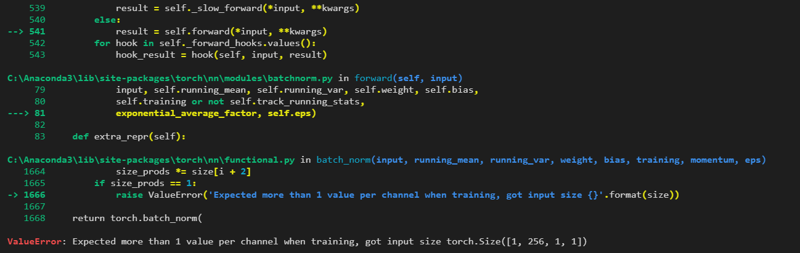

### Make the head.

Error occurs due to adaptive pool layer in ASPP head. I tried use different batch size, predict 2 classes instead of 1 (mask: H,W,2), convert mask to 3 channels - no way. So i built my own deeplabhead without apadtive pooling and with 1 out channel of classifier same as aux classifier.

### Results.

I conducted a series of trainings with different parameters:
- BCE loss function and classifiers with a finite sigmoid layers
- BCE logistLoss function
- BCE logistLoss function with lr 1e-5
- BCE logistLoss with input with a mask whose values are 0 and 1 (without torch(*to_tensor*) transform))
    > applying a *to_tensor* function to the mask of 0 & 255 gives a tensor not of 0 & 1, it gives with some gradient in field of separation of class and background (unique: 0.0, 0.011,...0.99, 1.0) more details in a notebook.
    
Training results are presented on the graph:
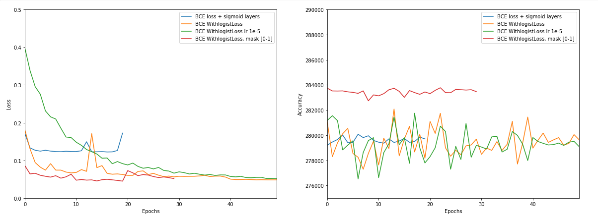
Let's start from the end, at first glance it might seem that it was the best result. But we must take into account the fact that the input mask in this case is different and contain only 0 and 1. Due to the lack of variation in values, accuracy gives the best result. But in practice, the resulting masks are not the best and cope poorly with the dividing field: 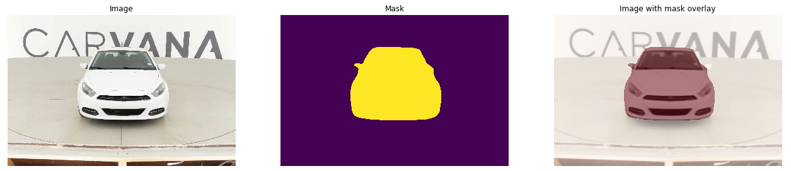

BCE loss with sigmoid layers should be the same as BCEWithlogistLoss because it's absolutely same things in theory. In practice this gives the most terrible results, this is a problem somewhere in the code of the function, I'm not the only one who ran into this: 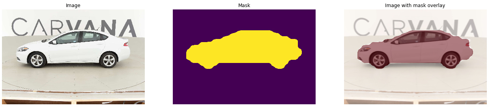  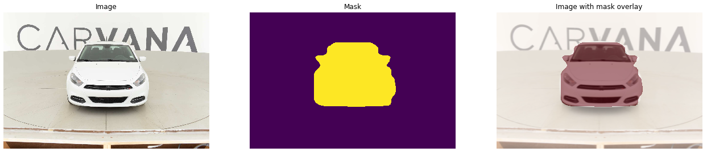

BCE with logist loss on learning rate 1e-4 and 1e-5 gave the best results(1e-4 a little better): 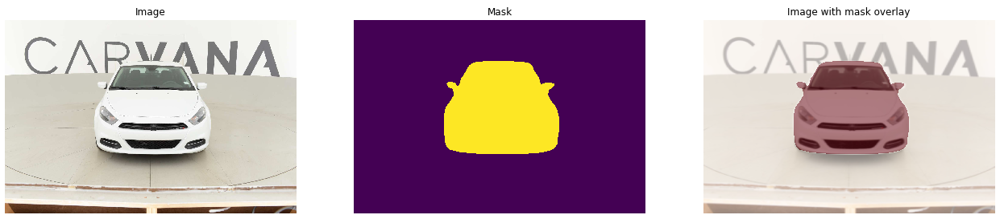 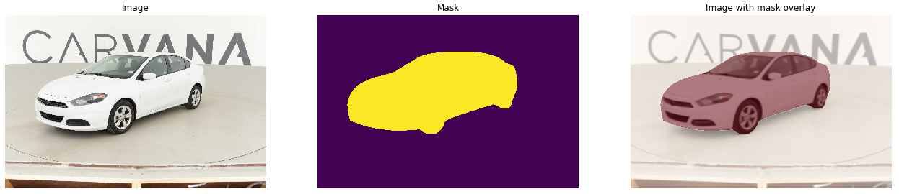

### Comparison with the original model.
Pre-trained Deeplab already should recognize cars, so it would be unfair not to compare the quality obtained with the original model 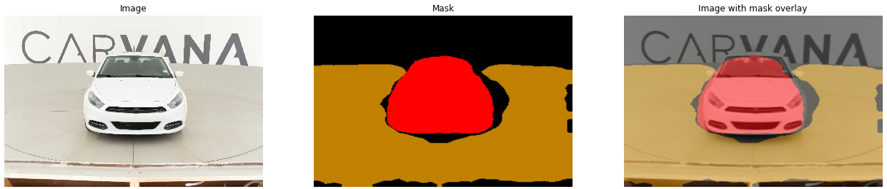 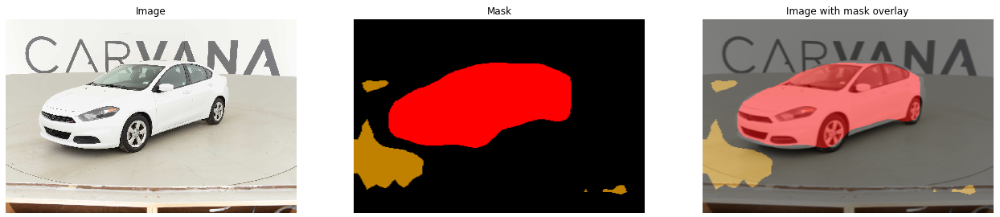
      > P.S. yellow is dinning table 

And test with another one car:
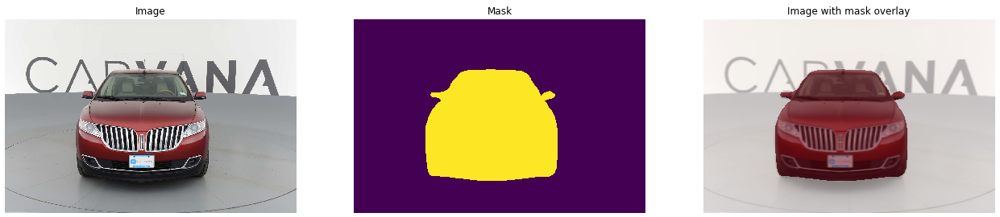 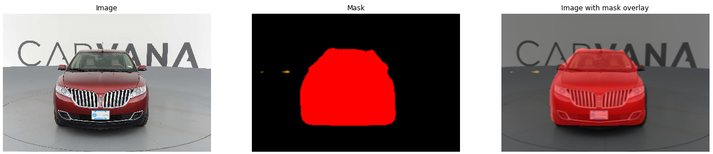
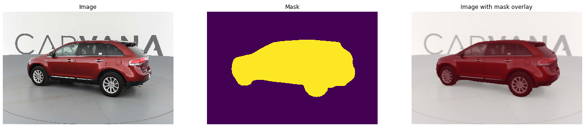 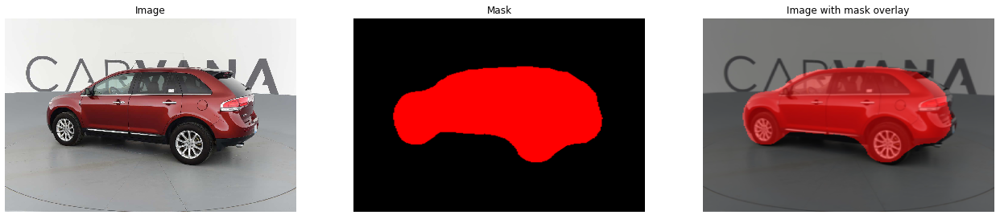
